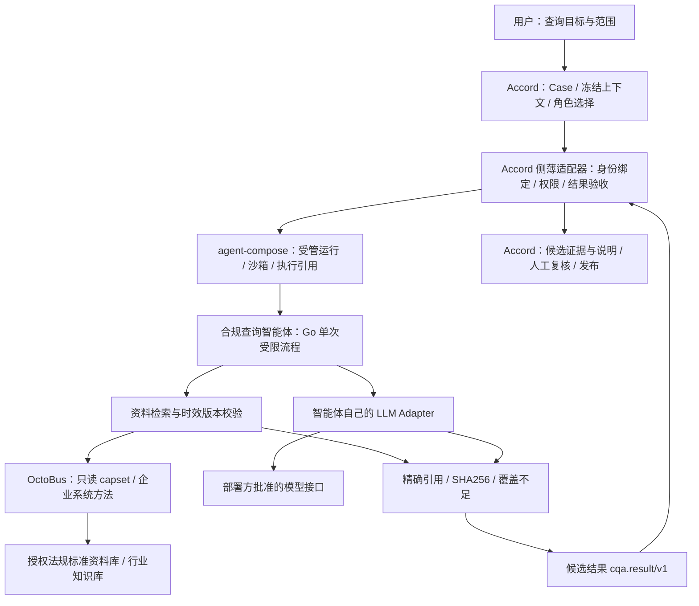

# 初始架构：一个领域智能体，三个清楚的接入边界

## 1. 变量、关系、约束

**变量**：问题 Q、主题 T、查询截止日期 D、地域 J、行业 I、资料版本集合 K、模型配置 M、能力授权 P、调用关联 C、候选回答 A。

**关系**：`候选回答 = 生成(问题, 检索并筛选(K, T, D, J, I))`；`引用 ⊆ 本次可用证据`；`结果 = 候选回答 + 来源 + 未解决项 + 关联摘要`。模型负责语言归纳，不拥有来源有效性、权限或发布决定。

**约束**：无资料不补造；来源不授予权限；模型不能改变外部目标；版本/日期/权限不确定要降级；本智能体不拥有 Case/审批/发布；外部服务失败不静默重试；记录已发生和未知状态，不说未经证明的 exactly-once。

## 2. 目标链路（不是本次已验证集成）

当前真实本地路径是：CLI/loopback HTTP → Go Engine → 本地 JSON 资料快照 → 确定性过滤/提取 → 文件回执 → 结构化结果。LLM 和 OctoBus 的 HTTP 客户端已写入，但真实调用尚未验证。Accord 薄适配器仍是提案。

## 3. 谁拥有什么事实

| 组件 | 所有权 | 不应拥有 |
|---|---|---|
| Accord | Case、工作流、黑板接受、人工决策、最终发布 | 智能体内部每个检索细节、运行环境实现 |
| agent-compose | Project/Agent/Sandbox/Run 生命周期与运行日志 | Accord 的 Case/Approval 权威 |
| 本智能体 | 一次查询、过滤、生成、候选引用、本地请求回执 | 新的任务中心、自治审批、直接发布 |
| OctoBus | 服务实例方法暴露与调用通路 | 所有知识必然正确/现行有效的保证 |
| 外部知识系统及资料管理员 | 文档版本、原文、权限、核验记录 | 自动决定用户本次查询已经被批准 |
| LLM | 候选措辞与归纳 | 法律效力认定、权限、更换模型或端点 |

源码不能证明外部法规“真实有效”；`curatorReviewed`/`validityCheckedAt` 是受信管理员记录。正式交付要核验实际资料维护流程，不能仅信一个布尔字段。

## 4. 为什么先用 Go 和固定流程

业务问题的复杂性在“证据与范围”，不是任意工具规划。选择 Go 单进程/标准库，降低部署和依赖负担；模型接口和数据接口做成明确 Adapter。核心不是 Coding Agent，用 Pi 自由调用 shell 对这种查询没有必要。

agent-compose 的 `run --command` 是上游实际支持的入口。因此建议先在它的 guest 中执行固定 Go 查询命令；compose 中 `provider: pi` 只是 provider 槽位，**该路径不会启动 Pi 的提示词循环，也不会产生外层 Pi + 内层 LLM 双重推理**。后续确需开放式研究再讨论 prompt 模式，不在起点同时堆叠两套 Agent Runtime。

这仍然由 agent-compose 创建/运行沙箱，不是拿普通 Docker Compose 冒充 agent-compose。其命令路径最终会由 guest shell 执行，所以**命令只能由受信适配器生成固定文本**；用户问题通过受限文件/未来批准的数据通道传递，绝不直接字符串拼接到 shell。

## 5. 核心模块

| 文件 | 职责 |
|---|---|
| `cmd/compliance-agent/main.go` | CLI、配置加载、输入输出、进程退出与本地 API 启动 |
| `internal/agent/engine.go` | 一次请求的受限流程与结果/回执衔接 |
| `knowledge.go` | 本地资料加载、关键词检索、领域/行业/日期过滤、重叠版本检测 |
| `clients.go` | LLM chat-completions、OctoBus Connect unary、引用 ID 验证 |
| `store.go` | O_EXCL 请求预留、原子结果写入、完成重放、未知不自动重试 |
| `http.go` | 带 bearer 的 loopback API、大小限制与固定错误码 |
| `types.go` / `config.go` | 有界输入输出、严格 JSON、明确网络与配置边界 |

## 6. 存储取舍

没有先建 SQLite、向量数据库或队列。本地 JSON 资料是可版本化快照；请求回执文件用于解决一个真实问题：失败/重复请求不能再调用一次模型却伪装原请求成功。

数据目录必须为可信操作用户私有，不能放在多人可写目录；文件权限检查不是完整宿主文件系统隔离。回执不提供授权、不取代 Accord 重试政策、不提供防管理员篡改的审计签名。`reserved/blocked` 请求重放只报告未知/待处理，不自动执行。未实现人工恢复命令。

agent-compose 沙箱若每次新建且不共享持久卷，本地去重无法覆盖跨沙箱。M1 必须以 Accord 的 Invocation/Attempt 权威和已验证的运行引用为主；是否挂可信共享回执卷，需要技术试验后确认。不能先承诺跨系统 exactly-once。

## 7. 查询质量边界

当前关键词检索便于建立可测基线，但不解决所有同义词、长问题或跨主题检索。结构化输出校验只证明引用属于证据集合，并不证明自然语言结论被证据蕴含。因此所有生成草稿保持 `humanReviewRequired:true`、`entailmentVerified:false`。

当前只检测同文档/同定位的重叠版本冲突，未实现跨法规、跨效力层级、跨地域的语义冲突识别。需要在真实业务评测后再引入混合检索、重排或冲突处理，而不是用“RAG”一词掩盖这些缺口。

## 8. 可扩展但不预建的平台

未来其他领域智能体可复用请求/引用/回执/接入边界，但本次不抽取共享 SDK 或通用多 Agent 平台。至少两个已交付智能体证明相同需求后，再依据证据提炼公共组件。

与 security-agent-suite 的关系只预留能力契约，不引入依赖；本任务没有授权改动该仓库或再次编排其运行。未来并轨须以当时批准的跨仓库方案为准。
